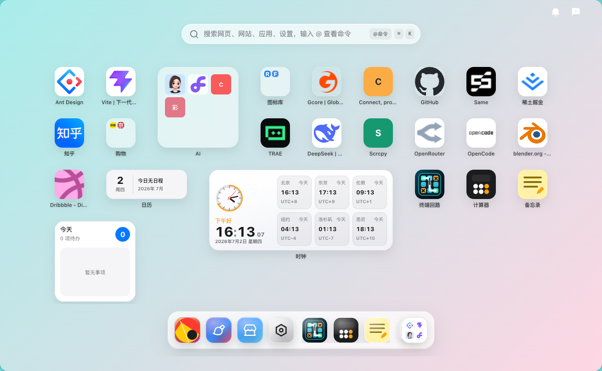
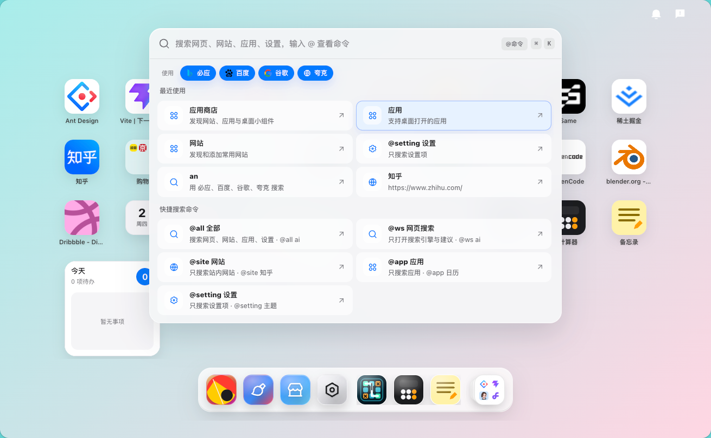

# Search Next

Search Next 是一个桌面化的导航与搜索入口，支持网站收藏、应用/小组件、统一搜索、主题壁纸、用户数据同步与后台管理。当前仓库采用 pnpm workspace 组织，前端、后台、后端 API 与内置小组件都在同一个仓库中维护。

## 预览





## 项目结构

- `apps/web`：用户侧主站，Vite + React。
- `apps/admin`：管理后台，Vite + React。
- `apps/api`：后端 API，NestJS + MongoDB + Redis。
- `apps/widgets/*`：内置小组件，每个目录是一个独立小组件工程。
- `apps/docs`：文档站点。
- `packages/*`：共享包。
- `scripts`：小组件脚手架、打包、截图等脚本。

## 本地运行指南

### 环境要求

- Node.js 20.19+ 或 22 LTS+。
- pnpm 10.x，仓库声明版本为 `pnpm@10.23.0`。
- MongoDB 与 Redis。后端启动时会连接两者，Redis 也用于缓存和登录状态。

可用 Corepack 启用对应 pnpm 版本：

```bash
corepack enable
corepack prepare pnpm@10.23.0 --activate
```

### 安装依赖

在仓库根目录执行：

```bash
pnpm install
```

### 配置后端环境变量

复制后端环境变量模板，并按本机服务填写 MongoDB、Redis、邮箱、存储等配置：

```bash
cp apps/api/.env.example apps/api/.env
```

最小本地配置通常只需要先确认这些值：

```dotenv
PORT=5151
mongo_host=127.0.0.1
mongo_port=27017
mongo_username=
mongo_password=
mongo_database=search_next
redis_host=127.0.0.1
redis_port=6379
redis_password=
redis_db=0
storage_service=local
local_storage_path=./assets/uploads
```

不要把真实密码、API Key、云存储密钥提交到仓库。

### 启动开发服务

分别启动：

```bash
pnpm dev:api
pnpm dev
pnpm dev:admin
```

或一次启动 API、主站和后台：

```bash
pnpm dev:all
```

默认地址：

- 主站：`http://localhost:8132`
- 管理后台：`http://localhost:8133`
- API：`http://localhost:5151`
- API 文档：`http://localhost:5151/doc`

开发环境下，主站和后台会把 `/api` 请求代理到 `http://localhost:5151`。如需改代理目标，可在启动前设置 `VITE_API_PROXY_TARGET`，或为对应前端应用补充本地 env 文件。

### 构建与预览

```bash
pnpm build
pnpm preview
```

后台与 API 单独构建：

```bash
pnpm build:admin
pnpm build:api
```

内置小组件构建：

```bash
pnpm build:widgets
```

### 发版命令

发版使用通用工具 `release-it` 负责版本选择、tag 和 GitHub Release。发版必须在 `release` 分支执行；Release 发布后，GitHub Actions 会自动校验 tag 属于 `release` 分支，再构建对应项目、打包 `dist/releases` 资产，并上传回这个 Release。发版前可先查看本次更改信息：

```bash
pnpm release:changes
```

推荐流程是先把待发布代码合并到 `release` 分支，再做版本发布：

```bash
git switch release
git pull --ff-only origin release
git merge --no-ff <source-branch>
git push origin release
```

完整发版使用 `v<version>` tag。发布后会触发 GitHub Actions 构建 API、主站生产包、管理后台、文档站和所有内置小组件：

```bash
GITHUB_TOKEN=ghp_xxx pnpm release -- 0.14.0
```

也可以单独发布某个项目。`RELEASE_PROJECT` 支持 `api`、`web`、`admin`、`docs`、`widgets`，以及单个小组件 `widget:<name>`。单项目 tag 会使用 `<project>-v<version>`，例如 `web-v0.14.0`、`todo-v0.2.0`：

```bash
RELEASE_PROJECT=web GITHUB_TOKEN=ghp_xxx pnpm release -- 0.14.0
RELEASE_PROJECT=widget:todo GITHUB_TOKEN=ghp_xxx pnpm release -- 0.2.0
```

如果想先预演流程：

```bash
RELEASE_PROJECT=web pnpm release:dry -- 0.14.0
```

如果想先保持草稿状态，使用下面的命令。草稿 Release 不会触发资产构建；在 GitHub 上发布草稿后，`Build release assets` workflow 才会开始构建和上传：

```bash
RELEASE_DRAFT=true RELEASE_PROJECT=widget:todo GITHUB_TOKEN=ghp_xxx pnpm release -- 0.2.0
```

也可以只准备本地发布资产，不创建 GitHub Release：

```bash
RELEASE_PROJECT=web RELEASE_VERSION=0.14.0 pnpm release:prepare
```

如果主站生产构建需要环境变量，可在仓库 Secrets 中配置 `WEB_PROD_ENV`，内容格式与 `apps/web/prod.env` 一致。GitHub Actions 会在构建前写入该文件；未配置时会创建空的 `prod.env`。

## 部署指南

推荐部署形态：

- `apps/api` 作为常驻 Node.js 服务运行，连接生产 MongoDB 与 Redis。
- `apps/web/dist` 作为主站静态资源部署。
- `apps/admin/dist` 作为后台静态资源部署，建议使用独立域名或子域名。
- 使用 Nginx、Caddy 或平台网关把 `/api` 反向代理到 API 服务，并把 `/static` 转发到 API 的静态文件服务。

### 生产构建

在服务器或 CI 中执行：

```bash
pnpm install --frozen-lockfile
pnpm build:api
pnpm build
pnpm build:admin
pnpm build:widgets
```

启动 API：

```bash
pnpm --filter search-next-api start:prod
```

生产环境请在 `apps/api/.env` 中配置真实的 MongoDB、Redis、邮箱、存储服务和 `PORT`。如果使用本地存储，`local_storage_path` 应放在持久化目录中，并纳入备份。

### 反向代理示例

主站和 API 同域部署时，可参考下面的 Nginx 配置。重点是 `/api/` 代理到后端时去掉 `/api` 前缀，因为后端路由本身不带该前缀。

```nginx
server {
  listen 80;
  server_name search.example.com;

  root /var/www/search-next/web;
  index index.html;

  location /api/ {
    proxy_pass http://127.0.0.1:5151/;
    proxy_set_header Host $host;
    proxy_set_header X-Real-IP $remote_addr;
    proxy_set_header X-Forwarded-For $proxy_add_x_forwarded_for;
    proxy_set_header X-Forwarded-Proto $scheme;
  }

  location /static/ {
    proxy_pass http://127.0.0.1:5151/static/;
    proxy_set_header Host $host;
  }

  location / {
    try_files $uri $uri/ /index.html;
  }
}
```

后台可用另一份静态站点配置，把 `root` 指向 `apps/admin/dist` 的部署目录。若前端和 API 不同域，需要同时处理 CORS、Cookie/鉴权策略与 `/api` 请求转发策略。

### 上线检查

- API 进程已连接生产 MongoDB 与 Redis。
- `/api` 能正确转发到后端，`/static` 能访问上传资源。
- 主站和后台刷新任意路由都能回退到 `index.html`。
- 上传目录、MongoDB、Redis 中的重要数据已配置备份。
- 生产环境不使用仓库中的示例密钥、个人密钥或开发环境配置。

## 小组件开发

创建脚手架：

```bash
pnpm widget:create react my-widget
pnpm widget:create vue my-widget
pnpm widget:create solid my-widget
```

启动某个小组件：

```bash
pnpm --filter my-widget-widget dev
```

构建并打包：

```bash
pnpm --filter my-widget-widget build
pnpm widget:pack my-widget
```

小组件入口是远程 ESM 代码，会在宿主页面权限下运行并访问注入的 SDK。仅加载自己开发或可信来源的小组件。

## 免责声明

本项目主要用于个人使用、学习与二次开发参考，不承诺适用于任何特定生产场景。部署、开放注册、接入第三方搜索、AI 服务、邮件服务或云存储前，请自行完成安全评估、权限隔离、限流、备份、隐私合规与成本控制。

项目中涉及的第三方图标、网站入口、搜索服务、AI 模型、云存储及其他外部资源，均受对应服务商协议约束。使用者应自行确认授权、额度、数据处理方式和当地法律法规要求。

任何因部署、配置、二次开发、加载不可信小组件或使用第三方服务造成的数据丢失、隐私泄露、账号风险、费用损失或服务不可用，由使用者自行承担。生产环境请勿提交或复用示例密钥、个人密钥和开发环境配置。
